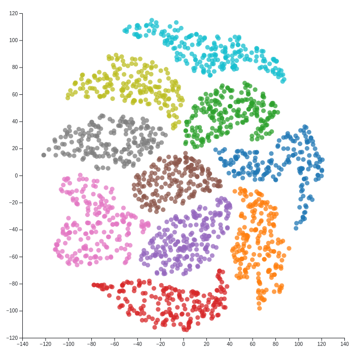

# PyTorch Telea Projections

This is an implementation of the paper [Visualising the Hidden Activity of Artificial Neural Networks](https://www.researchgate.net/publication/306049229_Visualizing_the_Hidden_Activity_of_Artificial_Neural_Networks) by Rauber et al. using Pytorch. 

The goal is to produce dimensionality reduced plots of learned representations of data.

## Visualisation 

A few test graphs are shown in the notebook files. Final visualisation is done using *D3.js* and can be found [here](https://observablehq.com/d/893faed80a0544d3) on Observable.